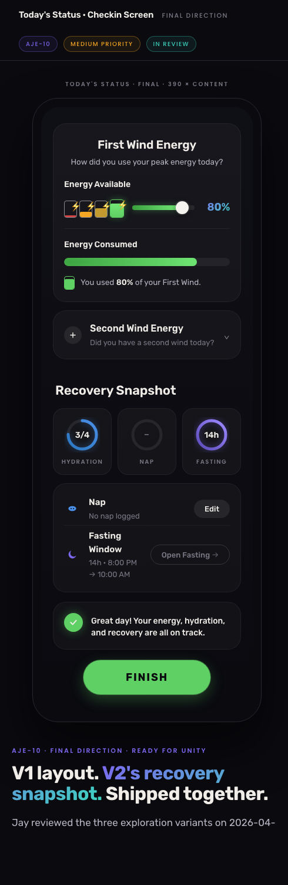
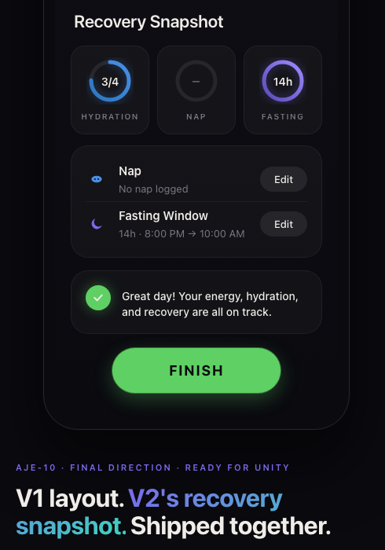
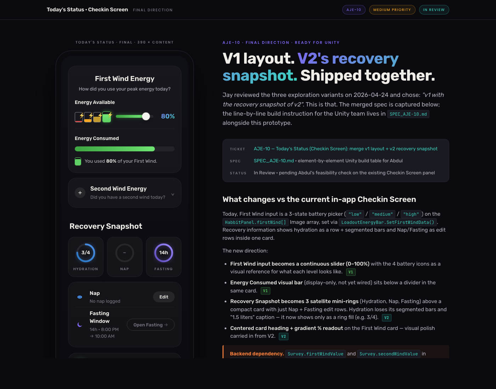

# SPEC · AJE-10 — Today's Status (Checkin Screen) Revamp

**Audience:** Abdul (Unity dev) · **Author:** Joe / Claude · **Status:** In Review

| | |
|---|---|
| **Linear ticket** | [AJE-10](https://linear.app/ajeo/issue/AJE-10/todays-status-checkin-screen-merge-v1-layout-v2-recovery-snapshot-ship) |
| **Live merged prototype** | https://todays-status-revamp.vercel.app *(updates after this PR merges)* |
| **Source HTML** | [`index.html`](./index.html) — single static file, viewable locally with `python3 -m http.server` |
| **Owning Unity panel** | `Assets/My Scripts/CheckInsPanel.cs` (1,152 lines, `SingletonBehaviourUI<CheckInsPanel>`) |

---

## TL;DR

The **First Wind Energy** input changes from a 3-state battery picker (low/medium/high) to a **continuous slider 0–100%**, with the four battery icons becoming a visual reference for what each level looks like (red/amber/yellow/green). The **Recovery Snapshot** changes from a single card containing a hydration row + Nap + Fasting edit rows, to a **3-mini-ring satellite layout** (Hydration / Deep Breathing Mins / Soundscape Minutes) above a **compact edit card** containing only Deep Breathing + Soundscape rows. Hydration loses its segmented bars and "1.5 liters" caption — it shows as a ring fill only.

The First Wind card heading and subtitle become **center-aligned**, and the "80%" readout next to the slider gets a **purple → teal gradient text** treatment for emphasis.

**Backend dependency:** `Survey.firstWindValue` and `Survey.secondWindValue` (both `string` today, in `GameManager.cs:1782`) need to accept a numeric percentage 0–100. Coordinate with the API owner before implementation.

### Energy Availability vs Energy Consumed (algorithm note for Abdul)

The UI exposes two distinct metrics. **Energy Availability** is calculated by the algorithm — straightforward for First Wind (derived from sleep conditions), harder for Second Wind (requires user input collected through the day). **Energy Consumed** is the user's slider input reflecting how much of that availability has been used. The prototype currently hardcodes 80% Consumed for visual reference; production should wire `firstWindValue` / `secondWindValue` (slider input → Consumed) and a backend availability field (TBD) for the underlying availability calculation.

---

## Visual reference

**Full mobile view of the merged design (top to bottom):**



**Recovery Snapshot section (the V2 component bolted into V1):**



**Desktop view with annotated docs panel beside the phone (the prototype itself, for context):**



---

## Interactive states demonstrated in the prototype

The prototype isn't just a static mock — three interactions are wired up so reviewers (and Abdul) can see the intended in-app behaviors:

| Interaction | What it does in the prototype | What it maps to in Unity |
|---|---|---|
| **Tap "Second Wind Energy" row** | Expands a panel with the same slider + 4-battery row + gradient % readout used by First Wind. Tapping a battery snaps the slider to that bucket; dragging the slider updates the active battery's color and the readout in real time. Tap again to collapse. | New `secondWindValue` slider bound to `DataConfig.userTodaySurvey.secondWindValue` (model change required — see Backend section). Use existing `PopupAndDownAnimator.cs` scale-tween for the expand. |
| **Tap "Open Deep Breathing →" on Deep Breathing row** | Shows a small toast "In-app: opens the breathing module" — intentionally non-interactive in this prototype. Logging is **not** a manual time entry; minutes are tracked authoritatively from completed breathing cycles inside the existing breathing module ([live](https://breathing-module.vercel.app) · [prototype source](../breathing-module/index.html) · [Unity hand-off spec](../breathing-module/SPEC_breathing.md)). | Routes into the existing `BreathworkPanel.cs` flow ([SPEC_breathing.md](../breathing-module/SPEC_breathing.md)). The Deep Breathing satellite ring's `image.fillAmount` updates from cycles completed there (cycles × pattern duration → minutes), not from any new modal in `CheckInsPanel`. The 5-cycle XP refund mechanic Jay called out in his 2026-05-01 23:46 SMS lives there too — see SPEC_breathing.md "XP economics" for the gate-deduct-and-refund flow that crosses [AJE-11](../paywall-revamp/) and [AJE-12](https://linear.app/ajeo/issue/AJE-12). |
| **Tap "Open Soundscape →" on Soundscape row** | Shows a small toast "In-app: opens existing Soundscape tool" — intentionally non-interactive in the prototype since soundscape already has its own tool. | Existing `FastingPopup.Show()` + `EnableBGOpacity()` from `CheckInsPanel.cs:1079`. No new flow. |

These interactions live in a single `<script>` block at the bottom of `index.html` — they're for prototype demonstration only. The Unity implementation references the existing scripts called out in the element-by-element table below.

---

## Element-by-element build table

Each row declares exactly how the element gets built in Unity. **If a row has any blank cell, treat it as a flag to discuss before starting.**

| # | Element | Current in-app | New (prototype) | Unity primitive | DOTween / animation | Owning script | Backend touch? |
|---|---|---|---|---|---|---|---|
| 1 | **First Wind Energy** card heading | Left-aligned `<h2>` | Center-aligned, font weight 600, size 20px | `TMP_Text` with `alignment = TextAlignmentOptions.Center`, `fontSize = 20`, `fontStyle = Bold` | None | `CheckInsPanel.cs` (visual only, no logic) | No |
| 2 | First Wind subtitle | Left-aligned `<p>` | Center-aligned, soft text color (`#b8b5c2`), 13.5px | `TMP_Text` with `alignment = TextAlignmentOptions.Center`, `color = #b8b5c2` | None | `CheckInsPanel.cs` | No |
| 3 | "Energy Consumed" label (First Wind) | Existing label | Same — left-aligned, font weight 600, size 14px | `TMP_Text` | None | `CheckInsPanel.cs` | No |
| 4 | **4-battery row** (visual reference) | `HabbitPanel.firstWind[]` is currently a 3-Image array (low/med/high), tinted Color.white (active) or Color.grey (inactive) by `LoadoutEnergyBar.SetFirstWindData()` | Now 4 batteries — red 0–25%, amber 26–50%, yellow 51–75%, green 76–100%. The active range gets the green border + glow. | Extend `HabbitPanel.firstWind[]` to 4 elements. Each battery is a parent `Image` (border) + child `Image` (fill) + a `TMP_Text` ⚡ glyph | On slider change: tween the active battery's border `color` + `outline` via DOTween — `image.DOColor(activeColor, 0.2f)` | `HabbitPanel.cs` (Image array), `LoadoutEnergyBar.cs` (color logic) | No (visual only) |
| 5 | **Slider** (primary input, 0–100) | Does not exist. Input is tap-on-battery, writes string `"low"\|"medium"\|"high"` to `DataConfig.userTodaySurvey.firstWindValue`. | Continuous slider 0–100, default 80, green gradient fill, white circular thumb | `UnityEngine.UI.Slider`, `minValue = 0`, `maxValue = 100`, `wholeNumbers = false`. Background `Image`, fill `Image` with green linear gradient, thumb `Image` (circular). | None for the drag itself. On `onValueChanged` callback: write to `DataConfig.userTodaySurvey.firstWindValue` (after model change) and update battery row #4. | New script or extend `CheckInsPanel.cs` — `OnFirstWindSliderChanged(float value)` | **YES — model change required (see Backend section)** |
| 6 | "80%" slider readout | Doesn't exist | Bold 18px text with purple→teal gradient color, 48px right-aligned | `TMP_Text` with `fontSize = 18`, `fontStyle = Bold`. For the gradient: use TMP's built-in **vertex gradient** (TMP_Text → "Color Gradient" component, set `Color Mode = Vertical`, top color `#7B68EE` purple, bottom color `#3DD4C0` teal). Alternatively a custom shader. | Tween via `TMP_Text.text` update on slider change (no tween needed since text is a direct binding) | `CheckInsPanel.cs` | No (mirrors slider) |
| 7 | Card divider | Doesn't exist | 1px horizontal line at `rgba(255,255,255,0.06)`, 18px top margin / 16px bottom | `Image` 1px tall, color `#FFFFFF` alpha 0.06, inside the Layout Group | None | `CheckInsPanel.cs` (prefab structure) | No |
| 8 | "Energy Consumed" progress bar label | Existing label or new | Same style as the Energy Consumed label above | `TMP_Text` | None | `CheckInsPanel.cs` | No |
| 9 | **Energy Consumed** progress bar | Existing bar (or new, depending on current state) | Horizontal green-gradient bar at 80% fill, 14px tall, fully rounded | `Image` with `Type = Filled`, `Fill Method = Horizontal`, `Fill Origin = Left`, `fillAmount = 0.80f`. Background `Image` for the empty track. | `image.DOFillAmount(0.80f, 0.6f).SetEase(Ease.OutCubic)` on panel open. **Hardcode 80% per the original ticket scope — don't wire actual consumption logic in this pass.** | `CheckInsPanel.cs` | No (display-only) |
| 10 | Energy Consumed caption ("You used **80%** of your First Wind.") | New | Mini-battery icon (18×26px) + TMP text. Number is bold. | `Image` (mini-battery) + `TMP_Text` with rich-text `<b>80%</b>` | None | `CheckInsPanel.cs` | No (mirrors hardcoded 80%) |
| 11 | **Second Wind expand row** (collapsed) | Existing row (it's already in the panel) | "+" plus-button (30px circle) + title "Second Wind Energy" + subtitle "Did you have a second wind today?" + chevron `⌄` | `Image` (plus button background) + `Image` (icon) + `TMP_Text` × 2 + chevron `TMP_Text`. Wrapper has card background + 22px border-radius. | On tap: instantiate the expanded layout (full slider+battery+readout, identical to First Wind). Use existing `PopupAndDownAnimator.cs` pattern: `transform.DOScale(Vector3.one, 0.5f).SetEase(Ease.OutBack)` on enable, reverse on collapse. | `CheckInsPanel.cs`, attach `PopupAndDownAnimator` to the expanded panel | Same model change as First Wind (`secondWindValue` enum→numeric) |
| 12 | "Recovery Snapshot" section header | Existing — text label | 22px font, weight 600, slight negative letter-spacing, 22px top margin | `TMP_Text` | None | `CheckInsPanel.cs` | No |
| 13 | **Hydration mini-ring** | Currently a row inside a card with a 4-segment bar + "(< 1.5 liters logged)" caption | 60px square satellite tile: 60px ring (5px stroke) showing fill amount, "3/4" text centered inside, "HYDRATION" label below | `Image` ring with `Type = Filled`, `Fill Method = Radial360`, `Fill Origin = Top`, `Clockwise = true`. Drive `image.fillAmount = DataConfig.userTodaySurvey.hydrationValue / hydrationGoal` (target is `4` per existing UI). Stack a track ring (greyed, fillAmount=1) behind. Center label = `TMP_Text` "3/4". Tile uses semi-transparent card background (rgba 0.03), 18px border radius. | `image.DOFillAmount(target, 0.5f).SetEase(Ease.OutCubic)` on panel open | `CheckInsPanel.cs` (3 new GameObjects), reads `DataConfig.userTodaySurvey.hydrationValue` (already `int` — no model change) | No |
| 14 | **Deep Breathing mini-ring** (formerly Nap) | Currently a row with icon + Edit button | 60px satellite tile, ring is empty (greyed) when nothing logged, label shows "—" | Same `Image` Filled/Radial360 setup. When nothing logged: only the track ring is visible, `mini-ring-val` shows "—" in muted text. When cycles are logged in the breathing module: fill amount = `cyclesCompletedToday * patternDurationSec / dailyTargetSec`. | Same `DOFillAmount` tween, fired when `CheckInsPanel.OnEnable` reads the day's totals back from `BreathworkPanel`. | `CheckInsPanel.cs` (read-only). Source of truth is the breathing module's per-cycle log — see element row 17 for routing. **No new "log nap" data path** — the old nap field is repurposed as a display-only minute total derived from breathing cycles. | No new backend field; reuses cycle data already produced by `BreathworkPanel` |
| 15 | **Soundscape mini-ring** (formerly Fasting) | Currently a row with icon + Edit button | 60px satellite tile: purple ring at 100% fill, "14h" text (placeholder until Soundscape data path is wired) | Same `Image` Filled/Radial360 setup, but stroke uses purple gradient (#5A49B8 → #9D8AFF). Drive `fillAmount = currentSoundscapeMinutes / soundscapeMinutesTarget` once that data path exists; in the meantime the existing `DataConfig.userTodaySurvey.fastingValue` binding stays as visual placeholder. | Same `DOFillAmount` tween | `CheckInsPanel.cs`. **Label change only** — backend Unity field (`fastingValue`) unchanged; product-facing rename. | No |
| 16 | Compact edit card | Currently the recovery card (with hydration row at top + Nap row + Fasting row, all standard padding) | Card with `padding: 14px 18px` and `padding: 6px 0` on rows. Only contains **Deep Breathing row** and **Soundscape row** — NO hydration row. | Same `Image` (card bg) + `VerticalLayoutGroup`, but with reduced padding values | None | `CheckInsPanel.cs` | No |
| 17 | **Deep Breathing row** (formerly Nap) | Existing — eye-shaped icon + "Nap" + "No nap logged" + Edit | Same icon (blue ellipse), title "Deep Breathing", subtitle "0 min logged today" (or "X min logged today" once cycles complete), button on right styled deferred — text "Open Deep Breathing →" with the existing `.deferred` style (matches Soundscape row's button) | `Image` (icon, 20×20) + `TMP_Text` × 2 + `Button` with rounded outline background. | None | `CheckInsPanel.cs`. **No more nap-modal flow on this screen** — button → existing `BreathworkPanel.Show()` (or whatever the routing pattern is into the breathing module). Drop wiring to `AddNapTodayPopup` from this row; if genuine nap logging is surfaced elsewhere (Profile, etc.) leave that flow alone, otherwise confirm with product before deleting the popup itself. | No (existing breathing-module flow) |
| 18 | **Soundscape edit row** (formerly Fasting Window) | Existing — moon icon + "Fasting Window" + duration text + Edit | Same icon (purple crescent moon — note color change from blue), title "Soundscape", subtitle "**14h · 8:00 PM → 10:00 AM**" *(note: "·" middot and "→" arrow — not "from … to …")*, Edit button labeled "Open Soundscape" | `Image` (moon icon, color `#7B68EE` purple) + `TMP_Text` × 2 + `Button` | None | `CheckInsPanel.cs`. Edit button still calls existing `FastingPopup.Show()` + `FastingPopup.Instance.EnableBGOpacity()` (existing pattern, see `CheckInsPanel.cs:1079`). **Product-facing rename only**; class rename is a future ticket. | No (existing flow) |
| 19 | Success banner | Existing element | Card with green checkmark circle (32px, glow), text "Great day! Your energy, hydration, and recovery are all on track." | `Image` (banner bg) + `Image` (green circle) + `Image` (checkmark) + `TMP_Text` | Conditional show: `gameObject.SetActive(thresholds.AllMet)` — suggested defaults to pressure-test: First Wind ≥ 60%, Hydration ≥ 3/4, Soundscape minutes hit target | `CheckInsPanel.cs` | No (computed locally from existing data) |
| 20 | **FINISH button** | Existing button — `CheckInsPanel.MarkTodaysStatusComplete()` | Same button. Pill shape, green bg, dark text "FINISH", letter-spacing 0.1em, 18px font, 700 weight, big drop shadow | `Button` + `Image` (green pill) + `TMP_Text`. Existing handler. | Existing — could add `transform.DOScale(0.95f, 0.1f).OnComplete(...)` press feedback if not already there | `CheckInsPanel.cs:673` `MarkTodaysStatusComplete()` → `NetworkAPImanager.IsTodaysStatusBtnAvailable()` | No (unchanged) |

---

## Token map — prototype CSS → Unity hex

The prototype's CSS variables map 1:1 to Unity Color values (RGB hex). Use these exactly so the in-app UI matches the prototype.

| CSS var | Hex | Unity Color | Where it's used |
|---|---|---|---|
| `--bg` | `#0A0A0F` | `new Color32(10, 10, 15, 255)` | Root background (also phone-screen base) |
| `--surface` | `#1A1A22` | `new Color32(26, 26, 34, 255)` | Card backgrounds (semi-transparent overlay also used) |
| `--border` | `#26262F` | `new Color32(38, 38, 47, 255)` | Card borders, dividers (use alpha 0.06 for inner card borders: `Color(1,1,1,0.06f)`) |
| `--text` | `#F0EDE8` | `new Color32(240, 237, 232, 255)` | Primary text |
| `--text-soft` | `#B8B5C2` | `new Color32(184, 181, 194, 255)` | Subtitle / secondary text |
| `--text-muted` | `#7A7985` | `new Color32(122, 121, 133, 255)` | Tertiary labels (uppercase satellite labels) |
| `--accent-green` | `#5FD063` | `new Color32(95, 208, 99, 255)` | Slider fill, FINISH button, success banner |
| `--accent-green-hi` | `#72E876` | `new Color32(114, 232, 118, 255)` | Slider fill highlight |
| `--accent-blue` | `#4A8FE7` | `new Color32(74, 143, 231, 255)` | Hydration ring (gradient with `#2A76BF`) |
| `--accent-purple` | `#7B68EE` | `new Color32(123, 104, 238, 255)` | Fasting ring & icon (gradient with `#5A49B8` → `#9D8AFF`) |
| `--accent-teal` | `#3DD4C0` | `new Color32(61, 212, 192, 255)` | Gradient text (with purple) |
| `--accent-amber` | `#F5A623` | `new Color32(245, 166, 35, 255)` | 2nd battery (amber) |
| `--accent-red` | `#D64545` | `new Color32(214, 69, 69, 255)` | 1st battery (red) |
| Yellow battery fill | `#C29A2F` | `new Color32(194, 154, 47, 255)` | 3rd battery |

**Gradients:** Use TMP vertex gradient or a small RawImage with a gradient texture (12px tall, stretched). For the slider fill, use a 1×8 gradient texture mapped horizontally.

---

## Spacing & typography reference

Pulled from the merged HTML CSS (`index.html` `<style>` block).

**Typography:**
- Family: `Rubik` for body and most UI; fallback `system-ui`. Already in the project? If not, add via TMP Font Asset (Rubik 300/400/500/600/700/800).
- Card heading (`h2`): 20px / 600 / letter-spacing -0.01em
- Card subtitle: 13.5px / 400 / `--text-soft`
- Card label ("Energy Consumed"): 14px / 600 / `--text`
- Section header ("Recovery Snapshot"): 22px / 600 / letter-spacing -0.01em
- Slider readout ("80%"): 18px / 700 / gradient
- Satellite ring value: 14px / 600
- Satellite label (UPPERCASE): 10px / 600 / letter-spacing 0.14em / `--text-muted`
- Edit button: 13px / 500
- FINISH button: 18px / 700 / letter-spacing 0.1em

**Spacing:**
- Phone screen padding: 28px top / 20px sides / 32px bottom
- Card padding (default): 20px top, 18px sides
- Compact card padding: 14px / 18px
- Card border-radius: 22px
- Satellite tile padding: 14px / 10px
- Satellite tile border-radius: 18px
- Card margin-bottom: 14px (between cards)
- Section header margin: 22px top / 14px bottom
- Recovery satellite row: `grid-template-columns: repeat(3, 1fr); gap: 10px`
- Compact card row padding: 6px 0 (overrides default 14px)

---

## Animation notes (DOTween)

All references use DOTween idioms already present in the project (`PopupAndDownAnimator.cs`).

| Surface | Animation | DOTween call | Trigger |
|---|---|---|---|
| Second Wind expand | Scale popup | `transform.DOScale(Vector3.one, 0.5f).SetEase(Ease.OutBack)` | Existing `PopupAndDownAnimator.OnEnable` |
| Second Wind collapse | Scale down | `transform.DOScale(Vector3.zero, 0.5f).SetEase(Ease.InBack)` | Existing `PopupAndDownAnimator.OnDisable` |
| Slider 80% readout text update | None — direct binding | `text.text = $"{value:0}%"` | `slider.onValueChanged` |
| Battery row tint on slider change | Color tween on active battery border | `border.DOColor(targetColor, 0.2f)` | `slider.onValueChanged` |
| Energy Consumed bar fill | Fill on panel open | `bar.DOFillAmount(0.80f, 0.6f).SetEase(Ease.OutCubic)` | `OnEnable` |
| Hydration / Nap / Fasting ring fill | Fill on panel open | `ring.DOFillAmount(targetFill, 0.5f).SetEase(Ease.OutCubic)` | `OnEnable` |
| FINISH button press feedback (optional) | Squish | `button.transform.DOScale(0.95f, 0.1f).SetLoops(2, LoopType.Yoyo)` | `OnPointerDown` |
| Success banner enter (optional) | Fade-in | `canvasGroup.DOFade(1f, 0.3f)` | When thresholds met |

---

## Backend dependency — model change required

**`Survey.firstWindValue` and `Survey.secondWindValue`** are currently `string` in `Assets/My Scripts/GameManager.cs:1782`:

```csharp
public class Survey
{
    public string firstWindValue = "";    // ← currently "low" | "medium" | "high"
    public string secondWindValue = "";   // ← same
    public int fastingValue = 6;          // already int — no change
    public int hydrationValue = 0;        // already int — no change
    public int sleepQuality = 1;
}
```

To support a continuous 0–100 slider, both need to become numeric (`int 0–100`, or `float 0–1`). This requires:

1. **API contract change.** `NetworkAPImanager.AddEnergyToTodayCheckIn("firstWind", DataConfig.userTodaySurvey.firstWindValue, ...)` (called from `HabbitPanel.cs:3833`) currently sends a string. The endpoint needs to accept a number.
2. **Drop or repurpose `GameManager.energy_List`** at `GameManager.cs:302`:
   ```csharp
   public static string[] energy_List = new string[3] { "low", "medium", "high" };
   ```
   This is referenced in `HabbitPanel.cs:396` and `:402` for the index lookup. Replace with direct numeric storage.
3. **Refactor `LoadoutEnergyBar.SetFirstWindData()` / `SetSecondWindData()`** (the entire `switch` body in `LoadoutEnergyBar.cs:14-32`) to a numeric → range → color mapping (red 0–25, amber 26–50, yellow 51–75, green 76–100).
4. **Refactor `HabbitPanel.SetFirstWindData(int index)` / `SetSecondWindData(int index)`** at `HabbitPanel.cs:3781-3826`. Currently a 3-case switch on `index` that writes the string back to DataConfig. Replace with: write the slider value (0–100) directly to `DataConfig.userTodaySurvey.firstWindValue`.

**Migration consideration:** Existing user data has `firstWindValue` as `"low"` / `"medium"` / `"high"`. Decide on a mapping (e.g. `"low" → 25`, `"medium" → 50`, `"high" → 75`) for one-time backfill, OR accept that historical entries remain strings and the UI handles both shapes during a transition period.

---

## Files Abdul will touch (Unity side)

Verified file paths (all confirmed to exist as of this spec):

| File | What changes |
|---|---|
| `Assets/My Scripts/CheckInsPanel.cs` | Owning panel — add slider + readout to First Wind card, restructure recovery section into satellite tiles + compact card. Existing `MarkTodaysStatusComplete()` handler unchanged. |
| `Assets/My Scripts/HabbitPanel.cs` | `firstWind[]` / `secondWind[]` Image arrays at line 3781 — extend to 4 elements. `SetFirstWindData(int)` / `SetSecondWindData(int)` at lines 3781-3826 — refactor switch → numeric mapping. |
| `Assets/My Scripts/LoadoutEnergyBar.cs` | Refactor 3-case switch in `SetFirstWindData()` / `SetSecondWindData()` (entire file is 54 lines) → numeric mapping. |
| `Assets/My Scripts/GameManager.cs` | `Survey` class at line 1782 — change `firstWindValue` / `secondWindValue` from `string` to numeric. Also handle `energy_List` at line 302 (drop or repurpose). |
| `Assets/Resources/Prefabs/UI/Panels/` | Checkin Screen prefab — add slider + readout, add 4th battery, add 3 mini-ring satellites, restructure recovery card. |
| `Assets/Custom Shader/OuterRoundedFillFixed.shader` | **Optional.** Use this for mini-ring rounded caps + glow if the default `Image.Type = Filled` look isn't enough. Already exists, has `_FillAmount` (0–1) and `_Color` properties. |

**Existing helpers reused, no changes needed:**
- `PopupAndDownAnimator.cs` — Second Wind expand
- `BreathworkPanel.cs` — Deep Breathing row "Open Deep Breathing →" button routes here. Spec for that panel lives at [SPEC_breathing.md](../breathing-module/SPEC_breathing.md) ([AJE-65](https://linear.app/ajeo/issue/AJE-65)). The breathing module already logs cycles + awards XP (5/cycle-set free, 20 Pro) and is where the 5-cycle XP refund mechanic Jay specified will be implemented.
- `FastingPopup.cs` — Soundscape row Edit button (`FastingPopup.Show()` + `EnableBGOpacity()`) — class rename out of scope for this ticket
- `NetworkAPImanager.AddEnergyToTodayCheckIn()` — server save (signature changes with the model change above)

**Unwired by this pass (confirm before deleting):**
- `AddNapTodayPopup.cs` — was the Nap edit modal target. AJE-10's Deep Breathing row no longer routes to it. If genuine nap logging is surfaced anywhere else in the app, leave it alone. If not, this can be retired in a follow-up.

---

## Open feasibility flags for Abdul

- **Slider model change** — needs API coordination before Unity work can land. If the API can't move off enums in this sprint, an interim is to keep the enum widened to 5 buckets (`"0"`/`"25"`/`"50"`/`"75"`/`"100"`) — but Joe's preference per Jay's direction is the continuous slider, so push the API change first if possible.
- **TMP Rubik font** — confirm the project already has a Rubik TMP Font Asset. If not, add one (300, 400, 500, 600, 700, 800 weights used).
- **Mini-ring caps** — `Image.Type = Filled` doesn't give rounded stroke caps natively. `OuterRoundedFillFixed.shader` is the upgrade path; spec assumes default Image first, with shader as a follow-up if visual fidelity falls short.
- **Hydration regression** — heads-up: the hydration row currently shows "X / 4 (Y liters logged)". The new design shows only "3/4" inside the ring — no liter count. Confirmed acceptable by Joe in plan review (2026-05-01). If product disagrees later, the satellite tile can grow a small caption underneath without breaking the layout.
- **Existing `firstWind[]` length** — currently 3 elements (matches the 3-state enum). Extending to 4 in the prefab requires duplicating an existing battery GameObject and re-binding the array. Easy if the array is `SerializedField`, slightly more involved if it's auto-populated.

---

## Acceptance criteria mirror (from AJE-10)

- [x] **Prototype repo updated so the live URL shows the combined v1 + v2-recovery-snapshot design only (no toggle).** — Done in this PR.
- [x] **Spec doc lists every changed element vs the current in-app Checkin Screen, with screenshots.** — This document; screenshots in `./spec-screenshots/`.
- [ ] **Unity dev (Abdul) confirmed feasibility against the existing Checkin Screen panel.** — *Pending Abdul. Joe to route.*

---

*Last updated: 2026-05-06 · Rename pass per Jay's 2026-05-01 SMS direction (Energy Consumed / Deep Breathing Mins / Soundscape Minutes) plus algorithm note for Abdul.*
